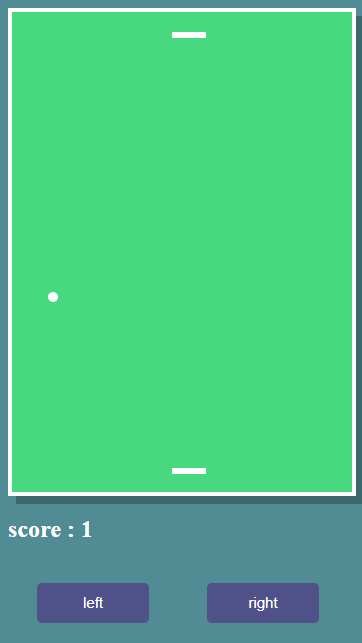
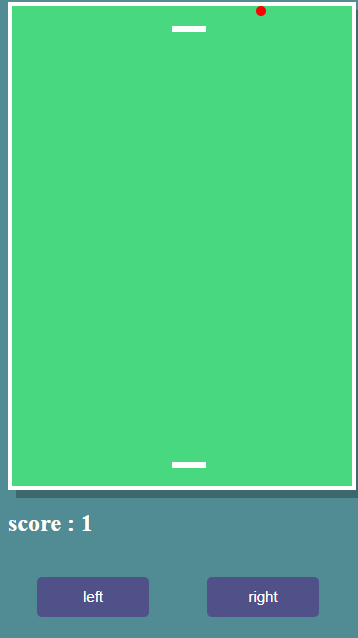
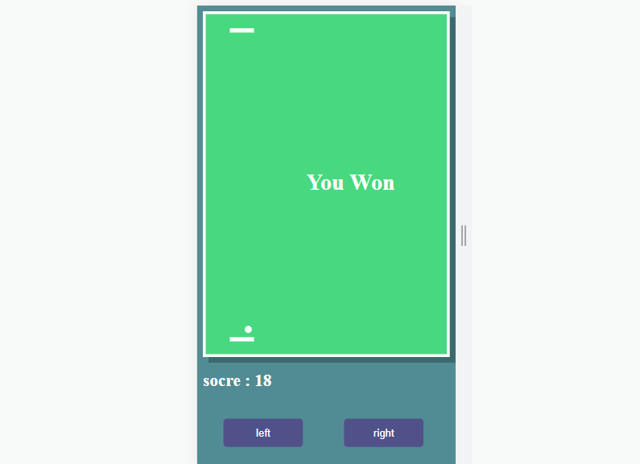

# TableTennis
Table tennis game 
Pong is one of the first computer games that ever created, 
this simple "tennis like" game features two paddles and a ball,
the goal is to defeat your opponent by being the first one to gain10 point,
a player gets a point once the opponent misses a ball. The game can be played with 
two human players, or one player against a computer controlled paddle. The game was 
originally developed by Allan Alcorn and released in 1972 by Atari corporations.
# controls
use the dark blue buttons named left and right to move both the blocks to left or right
# screenshots
starting  
  
when you lose the ball becomes red and sticks to the surface 
  
when you win the game the ball only moves verticaly giving you infinite scores and you win at the score of 10 only 
 

